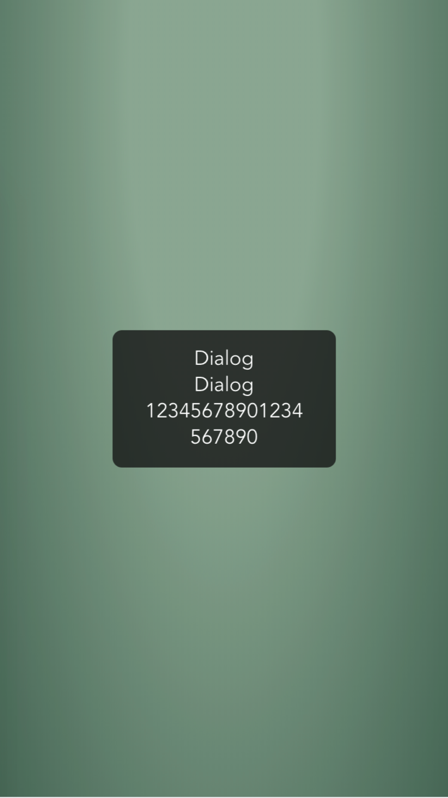
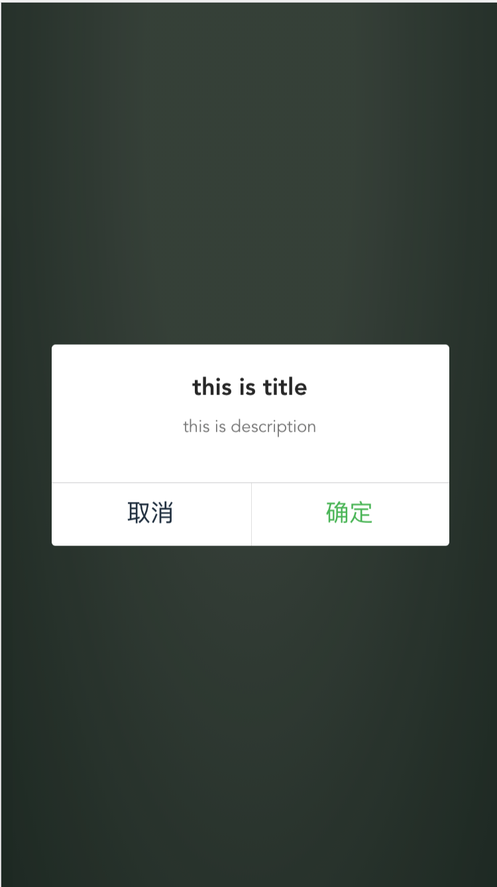
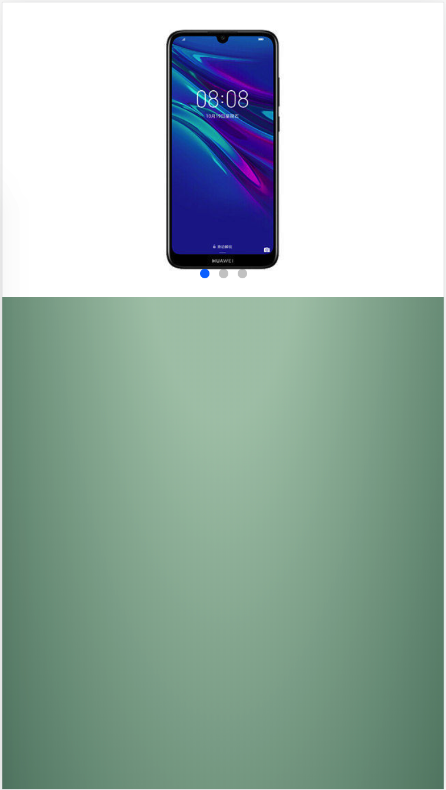
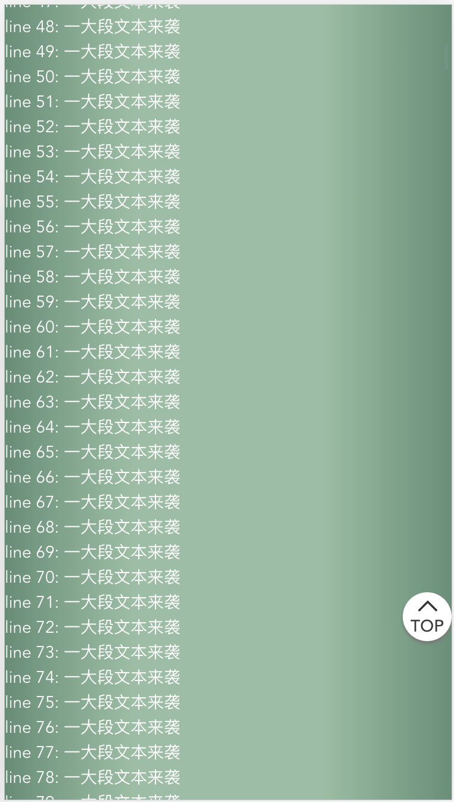
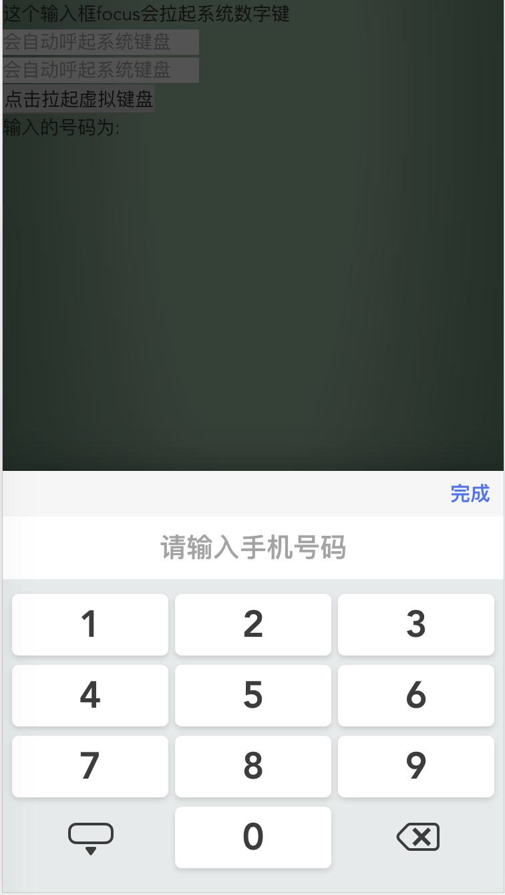
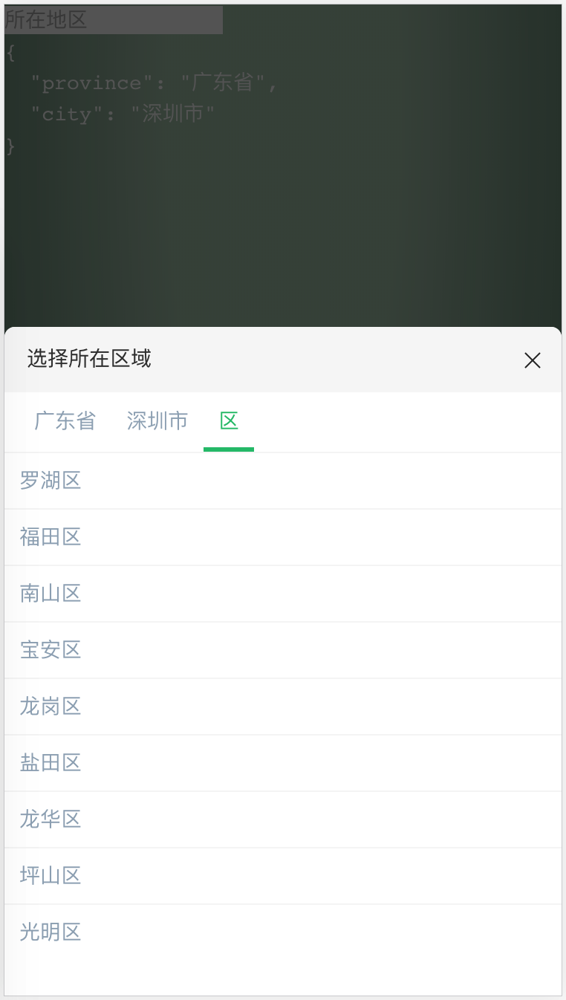
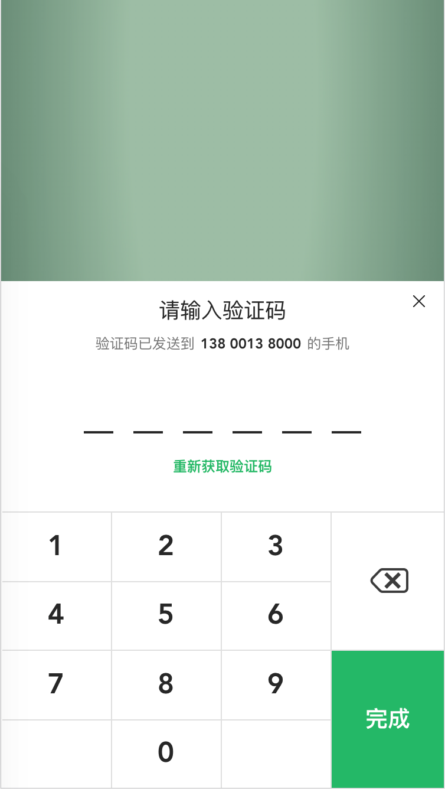
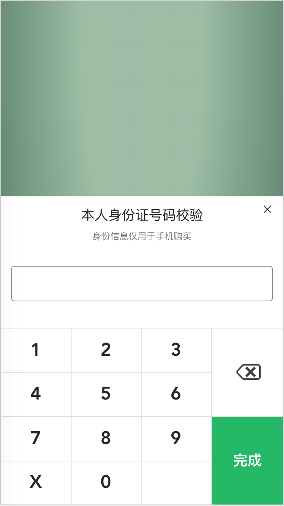
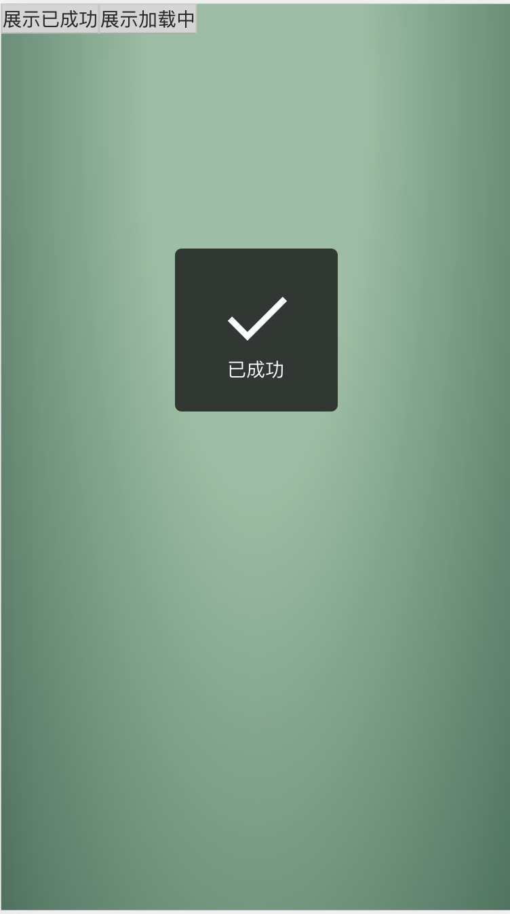
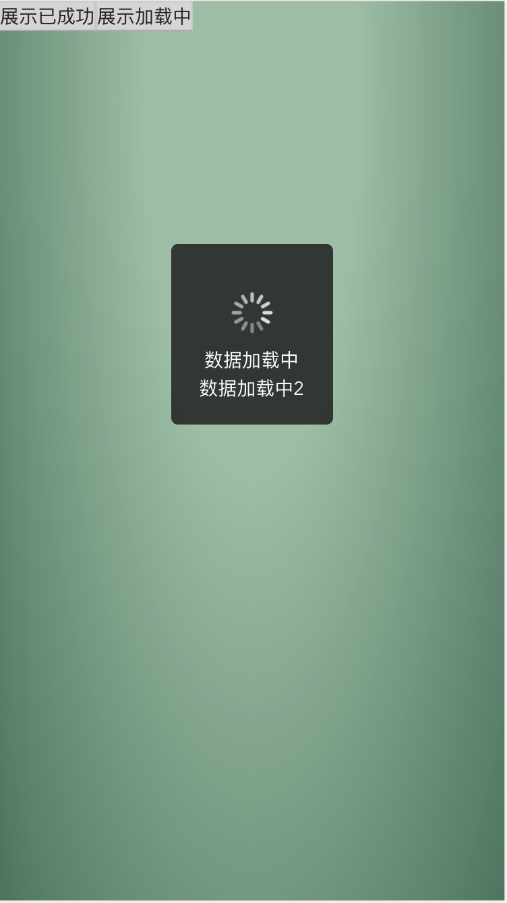

# vue-base-template-ts

Vue 基础插件&组件的ts版本

## 如何同步基础框架？
我们基于一份基础模版，通过git来设置不同的remote来关联模版与项目的关系，模版有更新时候项目可以git pull下来。

## 使用方法
```bash
# 拷贝样板项目
git clone git@github.com:ManfredHu/vue-base-template-ts.git your-project
cd your-project
# 修改远程仓库origin为你创建的git仓库ssh地址
git remote set-url origin your-git-oa-ssh-url
# 新增远程仓库base地址作为项目的基础模版地址
git remote add base git@github.com:ManfredHu/vue-base-template-ts.git
# 把代码推动到origin的develop分支
git checkout -b dev
git push -u origin dev
# 切换到master推送
git checkout master
git push -u origin master
# 开始开发
git checkout dev
git checkout -b feature/xxx
```

## Additional functions

- imagemin plugin
- CSS reset & rem
- Animation Less library
- vConsole dynamic load
- base component

## CSS reset & rem 方案

具体作用原因是因为`src/style/base/import.reset.less`设置了(初始化)

```less
html {
  font-size: 100px;
}
```

这样 1rem 就变成 100px 了。结合`src/style/base/import.variables.less`的`@rem: 200rem;`就可以得出这样一个公式

```
width: 750 / @rem
=> width: 750 / 200rem
=> width 750/200*100px
=> width: 375px
```

我们书写数值的时候，如测量设计稿宽度为 750x，那么就写`width: 750 / @rem`, 不需要再去换算。

同理，如果实际元素大小为 375px，则应该写 750/@rem

其次，`rem.js`脚本会计算 html 标签的 font-size 动态改变这个值使屏幕宽度一直为`750/@rem`。
具体实现为: html 的`font-size`为 document.documentElement.clientWidth / 375，最大为 200。

## vConsole

vconsole 比 eruda 小，是微信团队推出的移动端调试工具，框架封装了这块，可以在链接上加上`debug=vconsole`或者`vconsole=true`开启调试模式。console.log 会在这里显示

## 命名规范

### 组件命名规范

组件命名需要以大驼峰形式，name 以连字符形式

```js
Vue.component('todo-item', {
  // ...
})
export default {
  name: 'TodoItem'
  // ...
}
```

## 组件列表

- [x] 数字键盘（需要有数字按键）
  - [x] 长按删除键清除全部文本
- [x] 地区级联组件开发
  - [x] 支持锁定 1 级地区
- [x] 基本弹窗提示 alert 组件
- [x] 左右按钮 confirm 组件（单双按钮点击）
- [x] 滚动返回顶部组件
  - [ ] 支持拖拽
  - [x] 支持超过页面多少高度后显示/滚动超过多少隐藏
- [x] 轮播图无限滚动
- [ ] 分享
- [x] 验证码虚拟键盘
- [x] 身份证虚拟键盘

### 示例截图












## 单元测试

开源看[vue-test-utils](https://vue-test-utils.vuejs.org/zh/)

### 测试异步行为

`Vue.$nextTick`和`setTimeout`都可以配合 done 来使用，如 Dialog.spec.js 里面

```js
import { shallowMount, createLocalVue } from '@vue/test-utils'
import Dialog from '@/plugin/Dialog/index.vue'

// 使用插件
const localVue = createLocalVue()

describe('plugin Dialog.vue', () => {
  it('renders suc', done => {
    const wrapper = shallowMount(Dialog, {
      localVue,
      propsData: {
        text: ['Dialog', 'Dialog', '12345678901234567890'] // 3行
      }
    })
    const showTime = 1000
    wrapper.setData({ showTime }) // 展示1S
    wrapper.setData({ showMask: true })
    wrapper.vm.show()
    expect(wrapper.find('.dialog-bd').is('div')).toBe(true)
    expect(wrapper.find('.dialog-bd').html()).toBe(
      '<div class="dialog-bd">Dialog<br>Dialog<br>12345678901234567890</div>'
    )
    setTimeout(() => {
      // 1S后消失
      expect(wrapper.find('.dialog-bd').exists()).toBe(false)
      done()
    }, showTime)
  })
})
```

### 点击事件

有同学会好奇我们用到了`v-tap`，但是我们的测试用例写的是`wrapper.find('.comfirm-btn_primary.comfirm-btn').trigger('click')`。
这是因为我们的`v-tap`指令是适配 click 和 touch 的。在 PC 端会用`click`取代`touchStart/touchEnd`等。

因为 tap 会依据 `touchStart` 和 `touchEnd` 的坐标计算点击，这在测试用例并不容易实现。所以写测试的时候我们最好用 click 替代。

## e2e 测试

e2e 测试用 cypress 而不是 nightwatch，其实最好用puppeteer，有这么几点原因

1. nightwatch 对浏览器版本支持有限制，比如我最近被 Chrome 更新了到 76 的版本，nightwatch 测试用例就无法运行了，需要兼容，具体可以看[这里](https://github.com/vuejs/vue-cli/issues/4522)。当然 vue-cli 的 soda 是修复了，但是版本还在 rc，vue-cli 拉下来的代码 e2e 测试还是不能运行的
2. nightwatch 需要依赖 webdriver，JavaSDK 等环境，虽然支持多浏览器测试但是在现在的前端大环境下，多浏览器兼容基本没用到。故像 cypress 和 puppeteer 这种依赖 Chrome 的单浏览器支持的测试模式可以推行

这里用到了 Cypress，可以支持在 MacOS 下运行。CentOS 环境测试失败，错误未知。
puppeteer+Jest 的方案可支持 MacOS/CentOS/Docker 等环境，代码没有写。